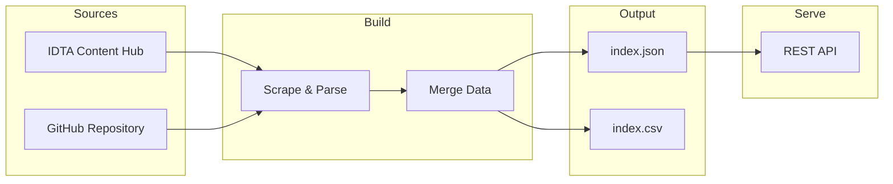

# Open SMT Index

[](https://github.com/hadijannat/open-smt-index/actions/workflows/ci.yml)
[](https://www.python.org/downloads/)
[](https://opensource.org/licenses/Apache-2.0)
[](https://github.com/astral-sh/ruff)

> Machine-readable index of AAS Submodel Templates — unifying IDTA registry and GitHub sources

---

## Features

| | Feature | Description |
|---|---------|-------------|
| **Build** | Merge IDTA Content Hub + GitHub repository into a unified index |
| **Serve** | Query templates via REST API with filtering and search |
| **Validate** | Ensure data quality with comprehensive sanity checks |
| **Export** | Output as JSON (structured) or CSV (flat) formats |

---

## Quick Start

```bash
# Install
pip install smt-index
playwright install chromium

# Build the index
smt-index build --out dist/

# Serve via API
smt-index serve --port 8000

# Query templates
curl http://localhost:8000/templates
```

---

## Installation

```bash
pip install smt-index
playwright install chromium  # Required for IDTA scraper
```

For development:

```bash
git clone https://github.com/hadijannat/open-smt-index.git
cd open-smt-index
pip install -e ".[dev]"
```

---

## Usage

### Build the Index

```bash
smt-index build --out dist/
```

Creates:
- `dist/index.json` — Structured index with full metadata
- `dist/index.csv` — Flat view with one row per template+version

### Serve the API

```bash
smt-index serve --port 8000
```

### Validate the Index

```bash
smt-index validate --index dist/index.json
```

---

## Output Formats

### JSON Structure

```json
{
  "schema_version": "1.0",
  "generated_at": "2024-01-15T10:30:00Z",
  "sources": {
    "idta_registered_templates": "https://industrialdigitaltwin.org/...",
    "github_submodel_templates": "https://github.com/admin-shell-io/..."
  },
  "templates": [
    {
      "id": "IDTA-02006",
      "title": "Digital Nameplate for Industrial Equipment",
      "status": "Published",
      "versions": [{"version": "2.0", "aasx_url": "..."}]
    }
  ]
}
```

### CSV Format

| id | title | status | version | aasx_url | pdf_url |
|----|-------|--------|---------|----------|---------|
| IDTA-02006 | Digital Nameplate... | Published | 2.0 | ... | ... |

---

## REST API

| Endpoint | Method | Description |
|----------|--------|-------------|
| `/health` | GET | Health check |
| `/templates` | GET | List all templates |
| `/templates?status=Published` | GET | Filter by status |
| `/templates?q=carbon` | GET | Search by keyword |
| `/templates/{id}` | GET | Get specific template |

**Example:**

```bash
# Get all published templates
curl "http://localhost:8000/templates?status=Published"

# Get template by ID
curl http://localhost:8000/templates/IDTA-02006
```

---

## Architecture



---

## Data Sources

| Source | URL | Data Provided |
|--------|-----|---------------|
| IDTA Content Hub | [industrialdigitaltwin.org](https://industrialdigitaltwin.org/content-hub/teilmodelle) | Status, descriptions, PDF links |
| GitHub Repository | [admin-shell-io/submodel-templates](https://github.com/admin-shell-io/submodel-templates) | Version folders, AASX files |

---

## Development

```bash
# Install dev dependencies
pip install -e ".[dev]"

# Run tests
pytest -v

# Lint and format
ruff check .
ruff format .
```

See [Contributing Guide](https://hadijannat.github.io/open-smt-index/contributing) for full development documentation.

---

## Documentation

Full documentation available at: **[hadijannat.github.io/open-smt-index](https://hadijannat.github.io/open-smt-index/)**

- [Installation](https://hadijannat.github.io/open-smt-index/installation)
- [Quick Start](https://hadijannat.github.io/open-smt-index/quickstart)
- [CLI Reference](https://hadijannat.github.io/open-smt-index/cli-reference)
- [API Reference](https://hadijannat.github.io/open-smt-index/api-reference)
- [Output Schema](https://hadijannat.github.io/open-smt-index/output-schema)
- [Examples](https://hadijannat.github.io/open-smt-index/examples)

---

## License

Apache License 2.0 — See [LICENSE](LICENSE) for details.
